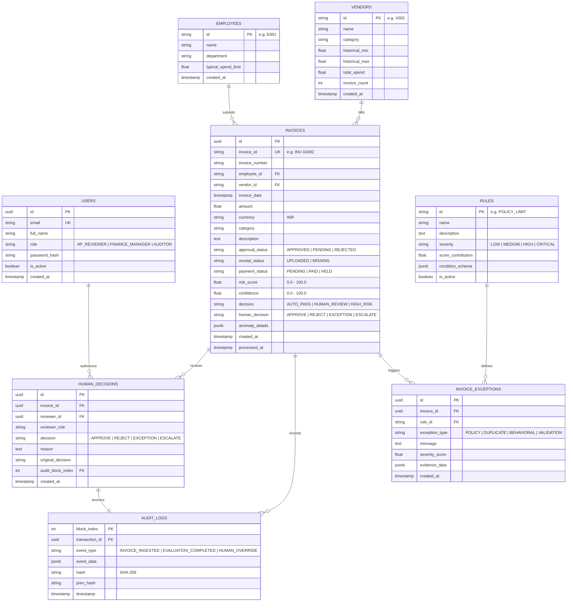
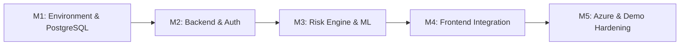

# WisePay Architectural Blueprint & Repository Audit
**Microsoft Innovate 2026 Hackathon Prototype**  
**Role:** Senior Software Architect & Technical Lead  
**Document:** System Architecture Blueprint & Gap Analysis  
**Target Stack:** React.js / Next.js Frontend · Python FastAPI Backend · PostgreSQL Database · Scikit-learn / Pandas Risk Engine · Microsoft Azure Deployment

---

## 1. Current State Assessment

A comprehensive forensic audit of the `WisePay` repository reveals an operational proof-of-concept with strong heuristic and UI foundations, but significant architectural gaps that prevent enterprise deployment on PostgreSQL and Azure.

### 1.1 Working Features
- **Frontend Presentation Layer (Next.js 16 / React 19 / Tailwind CSS v4):**
  - High-fidelity executive dashboard displaying real-time metrics, attention saved gauge, risk distribution charts, and network graphs.
  - Interactive exception queue with multi-criteria filtering (High Risk, Human Review, Auto-Pass, AP Reviewer amount thresholds).
  - Deep-dive investigation workspace (`/investigate/[id]`) with 6 functional sub-views: Overview, Evidence Chain Graph, Behavioral Fingerprinting, Duplicate Analysis, Counterfactual Remediation, and Audit Governance.
  - UI role switcher supporting three governance roles: `AP / FINANCE REVIEWER`, `FINANCE MANAGER`, and `AUDITOR` with Segregation of Duties (SoD) UI logic.
- **Explainability & Counterfactual Engine:**
  - Dynamic graph generation connecting invoices to submitters, vendors, duplicate candidates, triggered rules, and risk scores.
  - Counterfactual calculation engine providing actionable risk-reduction steps.
- **Cryptographic Audit Ledger (In-Memory / SQLite):**
  - Sequential SHA-256 hash-chaining mechanism linking each validation event and human override to its previous block hash (`prev_hash`).
  - Cryptographic verification endpoint checking hash integrity and detecting payload tampering.

### 1.2 Mocked & Heuristic Elements
- **Authentication & Authorization:**
  - Authentication is purely mocked on the frontend (`AuthContext.tsx`). There is no backend JWT generation, OAuth, session management, or password hashing. Any user can switch roles via client state.
- **Blockchain / Solana Trust Layer:**
  - While marketing materials and UI references cite "Solana Cryptographic Ledger", the backend executes an internal Python SHA-256 sequential hash chain stored in the local database. No live Solana RPC client or smart contract anchoring is present.
- **Isolation Forest Persistence:**
  - The `IsolationForest` anomaly model is trained on-the-fly during the database seed pass and stored in a Python module global variable (`_iso_forest`). It is not persisted as a serialized model artifact (`joblib`/`pickle`) or dynamically retrained.

### 1.3 Missing Features & Architectural Debt
- **Single-Invoice Real-Time Ingestion API:**
  - The backend only populates records via a monolithic startup script (`backend/data/seed.py`). There is no operational endpoint (e.g., `POST /api/invoices` or `POST /api/invoices/upload`) to ingest a new invoice/expense record, run it dynamically through the risk engine, and append it to the database and audit trail.
- **Database Architecture (SQLite Lock-in):**
  - The database connection in `backend/database.py` is hardcoded to `sqlite:///./sentinel.db`. PostgreSQL drivers (`psycopg2-binary` or `asyncpg`) are absent from `requirements.txt`.
  - Database schemas lack relational normalization: rules, triggered flags, and anomaly metadata are serialized as raw JSON strings in SQLite `Text` columns rather than PostgreSQL `JSONB` or dedicated relational tables (`Rules`, `Exceptions`, `Vendors`, `Employees`).
- **Hardcoded Configuration & Environment Isolation:**
  - Frontend API base URL is hardcoded to `http://localhost:8000/api` in `frontend/lib/api.ts` without `process.env.NEXT_PUBLIC_API_URL` fallbacks.
  - Backend lacks `.env` configuration management (`pydantic-settings` or `python-dotenv`).

---

## 2. Critical Blockers

The following issues must be resolved before proceeding with feature development and cloud deployment:

1. **Database Engine Incompatibility (SQLite vs. PostgreSQL):**
   - SQLite cannot handle concurrent writes from asynchronous ingestion workers, causes file-locking issues in containerized Azure App Services, and lacks PostgreSQL's native `JSONB` querying and indexing capabilities.
2. **Missing Ingestion & Processing Pipeline:**
   - The system cannot process new invoices on demand. Ingestion, validation, similarity scoring, anomaly evaluation, and audit-event creation are tightly coupled inside `seed.py` rather than exposed as modular, callable backend services.
3. **Absence of Backend Authentication & RBAC Enforcement:**
   - Role-based controls in `backend/routers/feedback.py` rely entirely on untrusted client-supplied JSON headers (`reviewer_role`, `reviewer_id`). An unauthenticated caller can bypass Segregation of Duties (SoD) by crafting an arbitrary `POST` request.
4. **Non-Persistent ML Artifacts:**
   - In-memory model storage causes race conditions in multi-worker Uvicorn environments (`uvicorn --workers 4`), where worker processes have desynchronized ML baselines.
5. **CORS & Environment Misconfiguration:**
   - `allow_origins=["*"]` is insecure for enterprise deployment, and hardcoded localhost URLs break once deployed to Azure App Service / Static Web Apps.

---

## 3. Data Models (PostgreSQL Target Architecture)

To support the Microsoft Innovate 2026 100-invoice demo and scalable enterprise AP workflows, the database schema will be normalized into PostgreSQL with proper foreign keys, constraints, and `JSONB` support.

---

## 4. API Contract (FastAPI REST Interface)

### 4.1 Authentication & User Management
- `POST /api/auth/register` — Register organizational user (AP Reviewer, Finance Manager, Auditor).
- `POST /api/auth/login` — Authenticate and return signed JWT bearer token.
- `GET /api/auth/me` — Retrieve current authenticated user profile and permissions.

### 4.2 Ingestion & Risk Scoring
- `POST /api/invoices/ingest` — Ingest a single invoice, execute real-time validation and risk scoring, persist to PostgreSQL, and append an immutable block to `audit_logs`.
- `POST /api/invoices/batch` — Ingest a curated batch (e.g. 100 benchmark invoices) with synthetic historical baselines.
- `GET /api/invoices` — Query paginated invoices with filters (`decision`, `risk_min`, `risk_max`, `vendor_id`, `search`, `page`, `size`).
- `GET /api/invoices/{id}` — Fetch full invoice details.
- `GET /api/invoices/{id}/similar` — Retrieve matched duplicate candidate with line-item comparison.

### 4.3 Investigation & Explainability
- `GET /api/investigation/{id}` — Fetch comprehensive forensic investigation bundle:
  - Triggered policy rules and severity contribution.
  - Duplicate similarity vector and exact match indicators.
  - Behavioral statistical fingerprint (Z-score, ratio to historical max).
  - Isolation Forest anomaly score.
  - Graph nodes and edges for visual evidence chain.
  - Counterfactual remediation steps.
  - Microsecond audit timeline.

### 4.4 Governance, Feedback & Audit Chain
- `POST /api/feedback/{invoice_id}` — Submit human review decision (`APPROVE`, `REJECT`, `EXCEPTION`, `ESCALATE`) with SoD authorization enforcement and sequential hash recording.
- `GET /api/feedback/stats` — Metrics on human review throughput and approval/rejection rates.
- `GET /api/audit/chain` — Paginated view of the sequential cryptographic hash ledger.
- `POST /api/audit/{invoice_id}/verify` — Recompute and verify cryptographic hashes for all events tied to an invoice.

### 4.5 Executive Dashboard & Analytics
- `GET /api/dashboard/stats` — High-level KPI aggregations (Total invoices, Auto-Pass rate, Human Attention Saved %, Total Volume vs Flagged Exposure).
- `GET /api/dashboard/risk_distribution` — 10-bucket risk score histogram.
- `GET /api/dashboard/top_risk_categories` — Top 5 violated policy rules.
- `GET /api/dashboard/network` — Graph topology of high-risk employee-vendor transaction clusters.
- `GET /api/dashboard/processing_stream` — Live telemetry feed of recently triaged invoices.

---

## 5. Implementation Roadmap

### Milestone 1: Environment & Database Setup (M1)
- Install PostgreSQL drivers (`psycopg2-binary`, `asyncpg`, `alembic`, `pydantic-settings`).
- Refactor `database.py` to support dynamic PostgreSQL / SQLite connections via environment variable `DATABASE_URL`.
- Define normalized SQLAlchemy 2.0 declarative models with `JSONB` support (`User`, `Vendor`, `Employee`, `Invoice`, `Rule`, `InvoiceException`, `AuditLog`, `HumanDecision`).
- Configure database migration scripts and local PostgreSQL container/service setup.

### Milestone 2: Backend Core & Authentication (M2)
- Implement password hashing (`passlib[bcrypt]` / `bcrypt`) and JWT token authentication (`pyjwt` / `python-jose`).
- Create FastAPI auth dependency (`get_current_user`, `require_role`) enforcing Segregation of Duties (SoD) on the backend.
- Build standard Pydantic request/response schemas for all endpoints.
- Establish clean modular service layers separating routing from business logic.

### Milestone 3: Python Risk/Validation Engine (M3)
- Modularize the risk engine into independent, unit-tested services:
  - `ValidatorService`: Schema and field integrity.
  - `DuplicateDetectionService`: Multi-vector TF-IDF cosine similarity and exact matching.
  - `PolicyRuleService`: Configurable rule evaluation.
  - `BehavioralEngine`: Historical baseline calculation, Z-scores, and spend variance.
  - `AnomalyModelService`: Serialized `IsolationForest` pipeline (`joblib`).
  - `RiskScorerService`: Composite non-linear risk and confidence estimation.
  - `CounterfactualService`: Algorithmic risk-reduction suggestions.
- Implement `POST /api/invoices/ingest` and `POST /api/invoices/batch` executing the full scoring pipeline on demand.

### Milestone 4: React AP Review Dashboard Integration (M4)
- Wire Next.js frontend to real FastAPI backend using configurable `NEXT_PUBLIC_API_URL`.
- Integrate JWT authentication into `AuthContext.tsx` with secure token persistence and auto-refresh.
- Connect live ingestion triggers, exception queue pagination, and real-time investigation panels to backend REST APIs.
- Validate Segregation of Duties enforcement in the review modal for all 3 user roles.

### Milestone 5: Azure Deployment & Demo Hardening (M5)
- Create `Dockerfile` and `docker-compose.yml` for multi-service local testing and Azure Container Apps / App Service deployment.
- Configure Azure Database for PostgreSQL Flexible Server connection strings and SSL certificates.
- Load and verify the 100-invoice benchmark dataset demonstrating exact duplicates, behavioral outliers, missing receipts, policy breaches, and auto-pass clearances.
- Execute full end-to-end audit verification tests.

---
