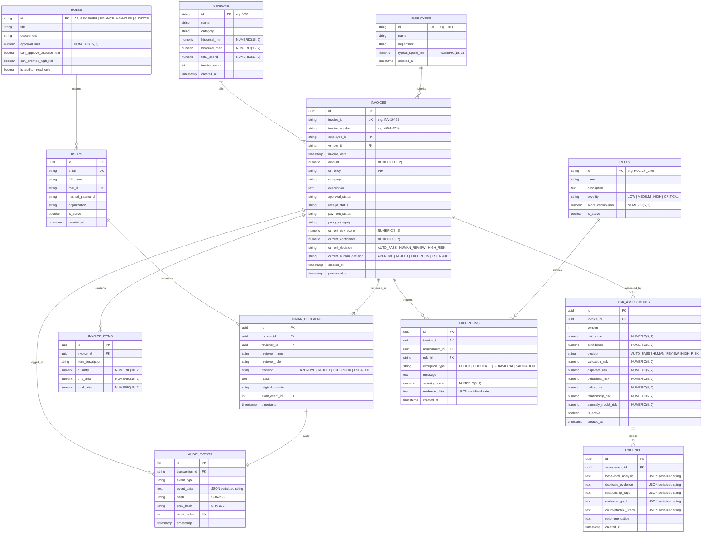

# WisePay Database Migration Analysis & Schema Design
**Microsoft Innovate 2026 Hackathon Prototype**  
**Role:** Senior Backend Architect & Database Engineer  
**Document:** `docs/database-migration-analysis.md`  
**Phase 2, Step 2:** Database & ORM Upgrade — Dependency Analysis & Schema Design

---

## 1. Executive Summary

This document establishes the architectural migration path from WisePay's proof-of-concept database layer (SQLite `sentinel.db`, monolithic `Transaction` model with unstructured stringified JSON columns, and unversioned floats) to an enterprise-grade, normalized, PostgreSQL-ready SQLAlchemy 2.0 schema.

### Core Architectural Mandates
1. **Financial Exactness:** Zero floating-point arithmetic for currency. All monetary values use `NUMERIC(15, 2)` (Python `Decimal`).
2. **Immutable Forensic Auditing:** `RiskAssessments` and `AuditEvents` are append-only. Historical risk evaluations are never overwritten in-place; new evaluations append new immutable rows. The sequential SHA-256 cryptographic chain (`prev_hash`) is preserved.
3. **Enum-Safe Public Identity:** All public entity identifiers utilize UUID4 to eliminate ID enumeration vulnerabilities.
4. **Zero Frontend Regressions:** Complete backward compatibility with the Next.js 16 / React 19 UI is maintained through structured serialization adapters and compatibility views.
5. **Decoupled Server Startup:** Server startup is decoupled from the heavy synthetic data generator (`backend/data/seed.py`). Seeding is migrated to a standalone CLI script (`backend/scripts/seed_demo_data.py`).

---

## 2. Current State Assessment

### 2.1 Database Access & Connection Setup
- **File:** `backend/database.py`
  - Hardcoded SQLite URI: `SQLALCHEMY_DATABASE_URL = "sqlite:///./sentinel.db"`.
  - Connect args: `connect_args={"check_same_thread": False}`.
  - No connection pooling, no environment variable support, and no PostgreSQL driver configured.
- **File:** `backend/main.py`
  - `@app.on_event("startup")` executes `Base.metadata.create_all(bind=engine)`.
  - Immediately counts rows in `Transaction`; if 0, synchronously blocks startup to run `seed_database(db)`.
  - Blocks FastAPI readiness for several seconds while generating synthetic transactions, computing TF-IDF, training an in-memory `IsolationForest`, and generating hashes.

### 2.2 Existing Model Limitations (`backend/models.py`)

| Existing Model | Identified Architectural Flaws |
| :--- | :--- |
| `Transaction` | 1. **Denormalized God-Object:** Combines employee, vendor, invoice, line item, validation, risk evaluation, and human decision into a single flat table.<br>2. **Dangerous Floating-Point Values:** `amount`, `risk_score`, `confidence` stored as SQLite `Float`. In financial systems, floats introduce rounding discrepancies.<br>3. **Raw Stringified JSON:** `rules_triggered` and `anomaly_details` stored as SQLite `Text` storing serialized JSON strings. No schema enforcement, indexing, or relational querying.<br>4. **Lack of Ingestion Versioning:** Updating a risk score overwrites the existing row, erasing historical scoring versions. |
| `AuditEvent` | 1. **Integer Auto-Increment PK:** Vulnerable to enumeration.<br>2. **Unstructured Payload:** `event_data` is an untyped JSON string.<br>3. **Loose Foreign Key:** `transaction_id` is a bare string without an enforced foreign key constraint. |
| `HumanDecision` | 1. **Primitive Relationship:** Directly mutates `Transaction.human_decision` string column.<br>2. **Untracked Overrides:** Lacks historical decision chaining when an invoice is escalated and subsequently approved. |

---

## 3. Frontend Constraints & Backward Compatibility Analysis

To guarantee that the Next.js frontend continues to operate without breaking, we performed a comprehensive audit of all frontend TypeScript interfaces and API consumers (`frontend/types/index.ts`, `frontend/types/auth.ts`, `frontend/lib/api.ts`, `frontend/components/queue/ExceptionTable.tsx`, `frontend/app/dashboard/page.tsx`, and `frontend/app/investigate/[id]/page.tsx`).

### 3.1 Specific Fields Required by the Frontend
The frontend directly binds to the following fields in API responses:

#### Invoices & Exception Queue (`/api/transactions`, `/api/transactions/{id}`)
- `id`: string (UUID string used in routing `/investigate/${tx.id}`)
- `invoice_id`: string (human-readable reference, e.g. `INV-48291`)
- `invoice_number`: string (vendor invoice number / PO reference, e.g. `V003-9124`)
- `invoice_date`: ISO 8601 string
- `amount`: number (rendered via `formatCurrency` in INR)
- `currency`: string (e.g. `"INR"`)
- `category`: string (e.g. `"IT Services"`, `"Travel"`)
- `description`: string (line description / memo)
- `employee_id`: string (e.g. `"E014"`)
- `employee_name`: string (e.g. `"Employee 14"`)
- `employee_dept`: string (e.g. `"Engineering"`)
- `vendor_id`: string (e.g. `"V001"`)
- `vendor_name`: string (e.g. `"Infosys Technologies"`)
- `approval_status`: string (`"APPROVED"`, `"PENDING"`, `"REJECTED"`)
- `receipt_status`: string (`"UPLOADED"`, `"MISSING"`)
- `payment_status`: string (`"PENDING"`, `"PAID"`, `"HELD"`)
- `policy_category`: string (`"Standard"`, `"Exception"`)
- `risk_score`: number (0.0 to 100.0)
- `confidence`: number (0.0 to 100.0)
- `decision`: string (`"AUTO_PASS"`, `"HUMAN_REVIEW"`, `"HIGH_RISK"`)
- `human_decision`: string | null (`"APPROVE"`, `"REJECT"`, `"EXCEPTION"`, `"ESCALATE"`)
- `rules_triggered`: JSON string or serialized list of rule objects
- `anomaly_details`: JSON string or serialized anomaly metadata
- `created_at`: ISO 8601 string
- `processed_at`: ISO 8601 string

#### Executive Dashboard (`/api/dashboard/stats`)
- `total`: integer
- `auto_pass`: integer
- `human_review`: integer
- `high_risk`: integer
- `human_attention_saved_pct`: number (float percentage, e.g. `88.2`)
- `total_amount`: number (sum of audited volume in INR)
- `flagged_amount`: number (sum of non-auto-pass exposure in INR)

#### Forensic Investigation Workspace (`/api/investigation/{id}`)
- `transaction`: Object matching the invoice fields above
- `behavioral_analysis`: Object containing `vendor_behavior`, `employee_behavior`, and `behavioral_anomaly_score`
- `duplicate_evidence`: Object containing `is_duplicate`, `similarity_score`, `matched_invoice_id`, `match_type`
- `policy_violations`: Array of `{ rule_id, rule_name, description, score_contribution }`
- `anomaly_details`: Object containing `anomaly_score`, `is_anomaly`
- `relationship_flags`: Array of `{ type, description }`
- `evidence_graph`: Object with `nodes` and `edges` arrays
- `counterfactual_steps`: Array of `{ action, risk_reduction, new_risk_score, new_decision, impact_area }`
- `audit_timeline`: Array of `{ type, timestamp, hash, prev_hash, block_index, description, data }`
- `recommendation`: string (human-readable AI recommendation)

#### Cryptographic Audit Chain (`/api/audit/chain`, `/api/audit/{id}/verify`)
- `id`: integer
- `transaction_id`: string
- `event_type`: string
- `event_data`: JSON string or object
- `timestamp`: ISO 8601 string
- `hash`: string (SHA-256)
- `prev_hash`: string (SHA-256)
- `block_index`: integer

### 3.2 Compatibility Strategy
To satisfy both relational normalization and frontend backward compatibility:
1. **Database Tier:** Cleanly normalized tables (`invoices`, `vendors`, `employees`, `risk_assessments`, `exceptions`, `evidence`, `audit_events`, `human_decisions`, `users`, `roles`).
2. **Adapter Layer (`Invoice.to_dict()` & Pydantic Schemas):**
   - The `Invoice` model joins with the latest active `RiskAssessment` and latest `HumanDecision` to automatically synthesize the exact legacy dictionary representation expected by `frontend/lib/api.ts`.
   - `rules_triggered` and `anomaly_details` are dynamically populated from relational child records (`exceptions` and `evidence`) and serialized as valid JSON strings.

---

## 4. Proposed Relational Schema (SQLAlchemy 2.0)



---

## 5. Detailed Table Specifications & Columns

### 5.1 `roles`
| Column | Type | Constraints | Description |
| :--- | :--- | :--- | :--- |
| `id` | `VARCHAR(32)` | `PRIMARY KEY` | Role ID: `'AP / FINANCE REVIEWER'`, `'FINANCE MANAGER'`, `'AUDITOR'` |
| `title` | `VARCHAR(64)` | `NOT NULL` | Formal human-readable title |
| `department` | `VARCHAR(64)` | `NOT NULL` | Department assignment |
| `approval_limit` | `NUMERIC(15, 2)`| `NOT NULL` | Max approval threshold (₹5,00,000 for AP; -1 for unlimited; 0 for Auditor) |
| `can_approve_disbursement` | `BOOLEAN` | `NOT NULL, DEFAULT FALSE`| Permission flag |
| `can_override_high_risk` | `BOOLEAN` | `NOT NULL, DEFAULT FALSE`| Permission flag |
| `is_auditor_read_only` | `BOOLEAN` | `NOT NULL, DEFAULT FALSE`| Segregation of Duties flag |

### 5.2 `users`
| Column | Type | Constraints | Description |
| :--- | :--- | :--- | :--- |
| `id` | `UUID` | `PRIMARY KEY` | Unique User UUID4 |
| `email` | `VARCHAR(255)` | `UNIQUE, NOT NULL, INDEX`| Enterprise login email |
| `full_name` | `VARCHAR(128)` | `NOT NULL` | Employee name |
| `role_id` | `VARCHAR(32)` | `FOREIGN KEY(roles.id), NOT NULL` | Assigned organizational role |
| `hashed_password` | `VARCHAR(255)` | `NOT NULL` | Passlib/bcrypt password hash |
| `organization` | `VARCHAR(128)` | `NOT NULL, DEFAULT 'Global Enterprise Corp'` | Organization name |
| `is_active` | `BOOLEAN` | `NOT NULL, DEFAULT TRUE` | Active account status |
| `created_at` | `TIMESTAMP` | `NOT NULL, DEFAULT NOW()`| Creation timestamp |

### 5.3 `vendors`
| Column | Type | Constraints | Description |
| :--- | :--- | :--- | :--- |
| `id` | `VARCHAR(32)` | `PRIMARY KEY` | Vendor identifier (e.g. `'V001'`) |
| `name` | `VARCHAR(128)` | `NOT NULL, INDEX` | Vendor name |
| `category` | `VARCHAR(64)` | `NOT NULL, INDEX` | Vendor industry category |
| `historical_min` | `NUMERIC(15, 2)`| `NOT NULL, DEFAULT 0.00`| Statistical lower bound |
| `historical_max` | `NUMERIC(15, 2)`| `NOT NULL, DEFAULT 0.00`| Statistical upper bound |
| `total_spend` | `NUMERIC(15, 2)`| `NOT NULL, DEFAULT 0.00`| Aggregated historical spend |
| `invoice_count` | `INTEGER` | `NOT NULL, DEFAULT 0` | Historical invoice count |
| `created_at` | `TIMESTAMP` | `NOT NULL, DEFAULT NOW()`| Vendor creation timestamp |

### 5.4 `employees`
| Column | Type | Constraints | Description |
| :--- | :--- | :--- | :--- |
| `id` | `VARCHAR(32)` | `PRIMARY KEY` | Employee ID (e.g. `'E001'`) |
| `name` | `VARCHAR(128)` | `NOT NULL` | Full employee name |
| `department` | `VARCHAR(64)` | `NOT NULL, INDEX` | Department |
| `typical_spend_limit`| `NUMERIC(15, 2)`| `NOT NULL, DEFAULT 100000.00`| Monthly spend baseline |
| `created_at` | `TIMESTAMP` | `NOT NULL, DEFAULT NOW()`| Creation timestamp |

### 5.5 `invoices`
| Column | Type | Constraints | Description |
| :--- | :--- | :--- | :--- |
| `id` | `UUID` | `PRIMARY KEY` | Public UUID4 (matches `id` in UI) |
| `invoice_id` | `VARCHAR(64)` | `UNIQUE, NOT NULL, INDEX` | Display ID (e.g. `'INV-28491'`) |
| `invoice_number` | `VARCHAR(64)` | `NULLABLE, INDEX` | Vendor invoice/PO number |
| `employee_id` | `VARCHAR(32)` | `FOREIGN KEY(employees.id), INDEX`| Submitting employee |
| `employee_name` | `VARCHAR(128)` | `NOT NULL` | Denormalized for zero-join speed |
| `employee_dept` | `VARCHAR(64)` | `NOT NULL` | Denormalized for zero-join speed |
| `vendor_id` | `VARCHAR(32)` | `FOREIGN KEY(vendors.id), INDEX` | Billed vendor |
| `vendor_name` | `VARCHAR(128)` | `NOT NULL` | Denormalized for zero-join speed |
| `invoice_date` | `TIMESTAMP` | `NOT NULL, INDEX` | Date of invoice issuance |
| `amount` | `NUMERIC(15, 2)`| `NOT NULL, INDEX` | Exact financial amount |
| `currency` | `VARCHAR(8)` | `NOT NULL, DEFAULT 'INR'` | Currency code |
| `category` | `VARCHAR(64)` | `NOT NULL, INDEX` | Spend category |
| `description` | `TEXT` | `NULLABLE` | Line memo/details |
| `approval_status` | `VARCHAR(32)` | `NOT NULL, DEFAULT 'PENDING'` | `'APPROVED'`, `'PENDING'`, `'REJECTED'` |
| `receipt_status` | `VARCHAR(32)` | `NOT NULL, DEFAULT 'MISSING'` | `'UPLOADED'`, `'MISSING'` |
| `payment_status` | `VARCHAR(32)` | `NOT NULL, DEFAULT 'PENDING'` | `'PENDING'`, `'PAID'`, `'HELD'` |
| `policy_category` | `VARCHAR(64)` | `NOT NULL, DEFAULT 'Standard'`| Compliance category |
| `current_risk_score`| `NUMERIC(5, 2)` | `NOT NULL, INDEX` | Active risk score (0.00 - 100.00) |
| `current_confidence`| `NUMERIC(5, 2)` | `NOT NULL` | Active confidence (0.00 - 100.00) |
| `current_decision` | `VARCHAR(32)` | `NOT NULL, INDEX` | `'AUTO_PASS'`, `'HUMAN_REVIEW'`, `'HIGH_RISK'` |
| `current_human_decision`| `VARCHAR(32)` | `NULLABLE, INDEX` | `'APPROVE'`, `'REJECT'`, `'EXCEPTION'`, `'ESCALATE'` |
| `created_at` | `TIMESTAMP` | `NOT NULL, DEFAULT NOW()`| Ingestion timestamp |
| `processed_at` | `TIMESTAMP` | `NOT NULL, DEFAULT NOW()`| Engine completion timestamp |

### 5.6 `invoice_items`
| Column | Type | Constraints | Description |
| :--- | :--- | :--- | :--- |
| `id` | `UUID` | `PRIMARY KEY` | Line item UUID |
| `invoice_id` | `UUID` | `FOREIGN KEY(invoices.id), INDEX` | Parent invoice |
| `item_description` | `TEXT` | `NOT NULL` | Line item description |
| `quantity` | `NUMERIC(10, 2)`| `NOT NULL, DEFAULT 1.00` | Quantity |
| `unit_price` | `NUMERIC(15, 2)`| `NOT NULL` | Price per unit |
| `total_price` | `NUMERIC(15, 2)`| `NOT NULL` | Total line price |

### 5.7 `rules`
| Column | Type | Constraints | Description |
| :--- | :--- | :--- | :--- |
| `id` | `VARCHAR(64)` | `PRIMARY KEY` | Rule key: `'POLICY_LIMIT'`, `'MISSING_RECEIPT'`, etc. |
| `name` | `VARCHAR(128)` | `NOT NULL` | Rule title |
| `description` | `TEXT` | `NOT NULL` | Explanation |
| `severity` | `VARCHAR(32)` | `NOT NULL` | `'LOW'`, `'MEDIUM'`, `'HIGH'`, `'CRITICAL'` |
| `score_contribution`| `NUMERIC(5, 2)` | `NOT NULL` | Point penalty added to risk score |
| `is_active` | `BOOLEAN` | `NOT NULL, DEFAULT TRUE` | Toggle status |

### 5.8 `risk_assessments` (Immutable)
| Column | Type | Constraints | Description |
| :--- | :--- | :--- | :--- |
| `id` | `UUID` | `PRIMARY KEY` | Evaluation run UUID |
| `invoice_id` | `UUID` | `FOREIGN KEY(invoices.id), INDEX` | Subject invoice |
| `version` | `INTEGER` | `NOT NULL, DEFAULT 1` | Run version (increments on re-eval) |
| `risk_score` | `NUMERIC(5, 2)` | `NOT NULL` | Composite risk score |
| `confidence` | `NUMERIC(5, 2)` | `NOT NULL` | Confidence estimate |
| `decision` | `VARCHAR(32)` | `NOT NULL` | Triage decision |
| `validation_risk` | `NUMERIC(5, 2)` | `NOT NULL, DEFAULT 0.00` | Sub-score: Schema/field validation |
| `duplicate_risk` | `NUMERIC(5, 2)` | `NOT NULL, DEFAULT 0.00` | Sub-score: Duplicate detection |
| `behavioral_risk` | `NUMERIC(5, 2)` | `NOT NULL, DEFAULT 0.00` | Sub-score: Behavioral deviation |
| `policy_risk` | `NUMERIC(5, 2)` | `NOT NULL, DEFAULT 0.00` | Sub-score: Deterministic rules |
| `relationship_risk`| `NUMERIC(5, 2)` | `NOT NULL, DEFAULT 0.00` | Sub-score: Network concentration |
| `anomaly_model_risk`| `NUMERIC(5, 2)` | `NOT NULL, DEFAULT 0.00` | Sub-score: Isolation Forest |
| `is_active` | `BOOLEAN` | `NOT NULL, DEFAULT TRUE` | Active assessment flag |
| `created_at` | `TIMESTAMP` | `NOT NULL, DEFAULT NOW()`| Immutable timestamp |

### 5.9 `exceptions`
| Column | Type | Constraints | Description |
| :--- | :--- | :--- | :--- |
| `id` | `UUID` | `PRIMARY KEY` | Exception record UUID |
| `invoice_id` | `UUID` | `FOREIGN KEY(invoices.id), INDEX` | Associated invoice |
| `assessment_id` | `UUID` | `FOREIGN KEY(risk_assessments.id), INDEX` | Specific assessment run |
| `rule_id` | `VARCHAR(64)` | `FOREIGN KEY(rules.id), INDEX` | Violated rule (if policy) |
| `exception_type` | `VARCHAR(32)` | `NOT NULL` | `'POLICY'`, `'DUPLICATE'`, `'BEHAVIORAL'`, `'VALIDATION'` |
| `message` | `TEXT` | `NOT NULL` | Error / warning message |
| `severity_score` | `NUMERIC(5, 2)` | `NOT NULL` | Impact weight |
| `evidence_data` | `TEXT` | `NULLABLE` | Serialized JSON evidence |
| `created_at` | `TIMESTAMP` | `NOT NULL, DEFAULT NOW()`| Timestamp |

### 5.10 `evidence`
| Column | Type | Constraints | Description |
| :--- | :--- | :--- | :--- |
| `id` | `UUID` | `PRIMARY KEY` | Evidence package UUID |
| `assessment_id` | `UUID` | `FOREIGN KEY(risk_assessments.id), UNIQUE` | 1-to-1 with assessment run |
| `behavioral_analysis`| `TEXT` | `NOT NULL` | Serialized JSON (vendor & employee z-scores) |
| `duplicate_evidence` | `TEXT` | `NOT NULL` | Serialized JSON (TF-IDF similarity & matched invoice) |
| `relationship_flags` | `TEXT` | `NOT NULL` | Serialized JSON (concentration flags) |
| `evidence_graph` | `TEXT` | `NOT NULL` | Serialized JSON (nodes and edges) |
| `counterfactual_steps`| `TEXT` | `NOT NULL` | Serialized JSON (remediation steps) |
| `recommendation` | `TEXT` | `NOT NULL` | AI verdict text |
| `created_at` | `TIMESTAMP` | `NOT NULL, DEFAULT NOW()`| Timestamp |

### 5.11 `human_decisions`
| Column | Type | Constraints | Description |
| :--- | :--- | :--- | :--- |
| `id` | `UUID` | `PRIMARY KEY` | Decision UUID |
| `invoice_id` | `UUID` | `FOREIGN KEY(invoices.id), INDEX` | Target invoice |
| `reviewer_id` | `UUID` | `FOREIGN KEY(users.id), INDEX` | Authenticated reviewer user UUID |
| `reviewer_name` | `VARCHAR(128)` | `NOT NULL` | Snapshot of reviewer name |
| `reviewer_role` | `VARCHAR(32)` | `NOT NULL` | Snapshot of role at time of decision |
| `decision` | `VARCHAR(32)` | `NOT NULL` | `'APPROVE'`, `'REJECT'`, `'EXCEPTION'`, `'ESCALATE'` |
| `reason` | `TEXT` | `NOT NULL` | Reviewer notes / justification |
| `original_decision`| `VARCHAR(32)` | `NOT NULL` | Machine decision before override |
| `audit_event_id` | `INTEGER` | `FOREIGN KEY(audit_events.id)` | Pointer to linked audit event |
| `timestamp` | `TIMESTAMP` | `NOT NULL, DEFAULT NOW()`| Decision timestamp |

### 5.12 `audit_events` (Immutable SHA-256 Hash Chain)
| Column | Type | Constraints | Description |
| :--- | :--- | :--- | :--- |
| `id` | `INTEGER` | `PRIMARY KEY, AUTOINCREMENT` | Monotonic primary key |
| `transaction_id` | `VARCHAR(64)` | `NOT NULL, INDEX` | Invoice ID or reference string |
| `event_type` | `VARCHAR(64)` | `NOT NULL, INDEX` | `'TRANSACTION_PROCESSED'`, `'HUMAN_REVIEW_SUBMITTED'`, etc. |
| `event_data` | `TEXT` | `NOT NULL` | Canonical JSON string payload |
| `hash` | `VARCHAR(64)` | `NOT NULL, UNIQUE` | SHA-256 current block hash |
| `prev_hash` | `VARCHAR(64)` | `NOT NULL` | SHA-256 previous block hash pointer |
| `block_index` | `INTEGER` | `NOT NULL, UNIQUE, INDEX` | Monotonically increasing block sequence |
| `timestamp` | `TIMESTAMP` | `NOT NULL, DEFAULT NOW()`| Event timestamp |

---

## 6. Decoupling Strategy: Removing `seed.py` from Application Startup

### 6.1 The Problem in Current Architecture
In `backend/main.py`:
```python
@app.on_event("startup")
def on_startup():
    Base.metadata.create_all(bind=engine)
    db = SessionLocal()
    from models import Transaction
    if db.query(Transaction).count() == 0:
        seed_database(db)
    db.close()
```
This causes:
- 10+ second startup delays.
- Worker process collision when running with multiple workers (`uvicorn main:app --workers 4`).
- Unpredictable test execution when running Pytest against in-memory or clean test databases.
- Impossible cloud container health check passing (`/health` probes timeout during seed).

### 6.2 Decoupled Architecture

```mermaid
flowchart TD
    subgraph AppStartup [FastAPI Application Startup]
        A1[FastAPI Starts] --> A2[Read DATABASE_URL]
        A2 --> A3[Verify Database Connection]
        A3 --> A4[Load Serialized ML Model: anomaly_model.joblib]
        A4 --> A5[Ready to Accept HTTP Requests]
    end

    subgraph StandaloneSeed [Standalone CLI: scripts/seed_demo_data.py]
        B1[CLI Invocation: python scripts/seed_demo_data.py]
        B1 --> B2[Seed 3 Roles: AP Reviewer, Finance Mgr, Auditor]
        B2 --> B3[Seed 3 Default Demo Users with Hashed Passwords]
        B3 --> B4[Seed 16 Vendors & 50 Employees]
        B4 --> B5[Seed 6 Standard Compliance Rules]
        B5 --> B6[Seed Invoices: Curated Benchmark Set]
        B6 --> B7[Run ML Evaluation & Build Evidence Packages]
        B7 --> B8[Generate Sequential SHA-256 Audit Chain Blocks]
        B8 --> B9[Commit Complete Demo Dataset to DB]
    end
```



### 6.3 Implementation Steps for Decoupling
1. **Clean `backend/main.py` Startup Event:**
   - Replace the heavy database query and `seed_database(db)` call with a lightweight table existence check / migration verification.
   - Load pre-trained `backend/engine/artifacts/anomaly_model.joblib` into memory.
   - Ensure the server starts in $< 500\text{ ms}$ even on completely blank databases.
2. **Implement `backend/scripts/seed_demo_data.py`:**
   - Standalone CLI utility using `argparse`:
     - `--count <N>`: Default to 100 benchmark invoices for instant demo loading, or 9,000 for high-volume stress testing.
     - `--reset`: Cleans existing tables before seeding.
     - `--train-ml`: Optionally retrains and updates `anomaly_model.joblib`.
3. **Alembic Database Migration Pipeline:**
   - Set up Alembic in `backend/alembic/` configured to inspect `Base.metadata`.
   - Provide an initial migration script (`0001_initial_schema.py`) defining all tables and constraints.
   - CLI command for migrations: `alembic upgrade head`.

---

## 7. Verification & Backward Compatibility Guarantee

### 7.1 Field-by-Field Mapping Verification

| Frontend Field | Legacy SQLite Column | Target Normalized Source | Serialization Rule in Adapter |
| :--- | :--- | :--- | :--- |
| `id` | `transactions.id` (str) | `invoices.id` (UUID) | `str(self.id)` |
| `invoice_id` | `transactions.invoice_id` | `invoices.invoice_id` | Direct string |
| `amount` | `transactions.amount` (float) | `invoices.amount` (Numeric) | `float(self.amount)` for JSON serialization |
| `risk_score` | `transactions.risk_score` (float)| `invoices.current_risk_score` | `float(self.current_risk_score)` |
| `confidence` | `transactions.confidence` (float)| `invoices.current_confidence` | `float(self.current_confidence)` |
| `decision` | `transactions.decision` | `invoices.current_decision` | Direct string |
| `human_decision`| `transactions.human_decision`| `invoices.current_human_decision`| String or `None` |
| `rules_triggered`| `transactions.rules_triggered`| Joined from `exceptions` where `exception_type = 'POLICY'` | JSON string serialization matching frontend parser |
| `anomaly_details`| `transactions.anomaly_details`| Joined from `evidence` table | JSON string serialization matching frontend parser |

---
